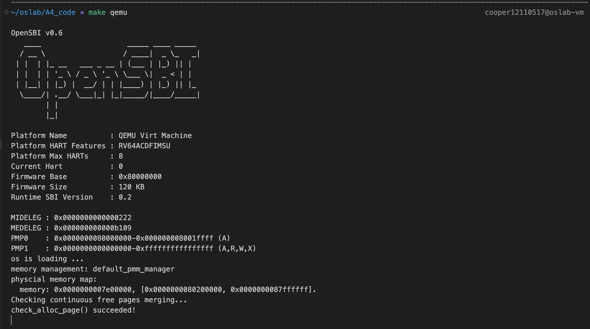

# CS302 OS A4

Zhiyuan Zhong 12110517

## Q1

Requirements for CPU hardware:

| Hardware Requirements                                                    | Notes                                                                           |
| ------------------------------------------------------------------------ | ------------------------------------------------------------------------------- |
| Privileged mode                                                          | Needed to prevent user-mode processes from executing privileged operations      |
| Base/bounds registers                                                    | Need pair of registers per CPU to support address translation and bounds checks |
| Ability to translate virtual addresses and check if within bounds limits | Circuitry to do translations and check limits                                   |
| Privileged instruction(s) to update base/bounds                          | OS must be able to set these values before letting a user program run           |
| Privileged instruction(s) to register exception handlers                 | OS must be able to tell hardware what code to run if exception occurs           |
| Ability to raise exceptions                                              | When processes try to access privileged instructions or out-of-bounds memory    |

Requirements for OS:

| OS Requirements        | Notes                                                                                                                      |
| ---------------------- | -------------------------------------------------------------------------------------------------------------------------- |
| Memory management      | Need to allocate memory for new processes; Reclaim memory from terminated processes; Generally manage memory via free list |
| Base/bounds management | Must set base/bounds properly upon context switch                                                                          |
| Exception handling     | Code to run when exceptions arise; likely action is to terminate offending process                                         |

The cooperation needed at boot and runtime:

## Q2

| Aspects        | Segmentation          | Paging             |
| -------------- | :-------------------- | ------------------ |
| size of chunks | variable-sized | fixed-sized |
| management of free space | 1. compact physical memory by rearranging the existing segments. The OS could stop whichever processes are running, copy their data to one contiguous region of memory, change their segment register values to point to thenew physical locations, and thus have a large free extent of memory with which to work. (But expensive) 2. Simpler: use a free-list management (first-fit, best-fit, worst-fit) | OS keeps a free list of all free pages for this, and just grabs the first few free pages (of the required size) off of this list|
| context switch overhead | high. OS saves and restores base/bound registers.| low. Updating page tables, which are typically smaller and quicker. But requires one extra memory reading in order to first fetch the translation from the page table (entry)|
| fragmentation | external fragmentation | internal fragmentation |
| status bits and protection bits| **Segment bits**: the first few bits protection bits: whether or not a program can read or write a segment, or perhaps execute code that lies within the segment **A grows positive bit**: the hardware also needs to know which way the segment grows (1-segment grows in the positive direction, 0-negative) |  **Valid bit**: to indicate whether the particular translation is valid.   **Protection bits**: indicating whether the page could be read from, written to, or executed from.  **Present bit**: whether this page is in physical memory or on disk (i.e., it has been swapped out)  **Dirty bit**: whether the page has been modified since it was brought into memory. **Reference bit** (a.k.a. accessed bit): track whether a page has been accessed, and is useful in determining which pages are popular |

## Q3

- Page size: 8KB=$2^{13}$B, the offset has 13 bits.
- PTE size: 4B. To fit a page table into a single page, # of PTE in one page table = $2^{13} / 2^2 = 2^{11}$
- The virtual address apace has 46 bits, to map the entire virtual address space, # of pages = $2^{46} / 2^{13} = 2^{33}$
- $(2^{11})^3 = 2^{33}$, we need to have 3 levels page table, each page table has 11 bits.

The address translation is as follows: L1, L2, L3 refers to 3 level page tables, the PFN is read by L3 page tables. And the offset is 13 bits.
|L1 | L2 | L3 | Offset |
| :-- | - | - | - |
| 45-35 | 34-24 | 23-13 | 12-0 |

## Q4

(a) page size = $2^{12} = 4$KB. 20 bits for page can store $2^{20}$ pages, each PTE is 4B, so the maximum page table size is $2^{20} \times 4 = 4$MB.

(b) `0xC302C302`(base 16) = `1100 0011 0000 0010 1100 0011 0000 0010`(base 2). The 1-st level page number is `1100001100`(base 2) = 780(base 10), the offset: `0011 0000 0010`(base 2) = 770(base 10).

`0xEC6666AB`(base16) = `1110 1100 0110 0110 0110 0110 1010 1011`(base 2). The 2-nd level page number is `1001100110`(base 2) = 614(base 10), the offset: `011010101011`(base 2) = 1707(base 10).

## Q5

- The code: `default_free_pages()` in `default_pmm.c`

- The reult:

## Q6

- The code: The difference is in `best_fit_alloc_pages()`, other functions are the same as `default_pmm.c`.

- The result:

