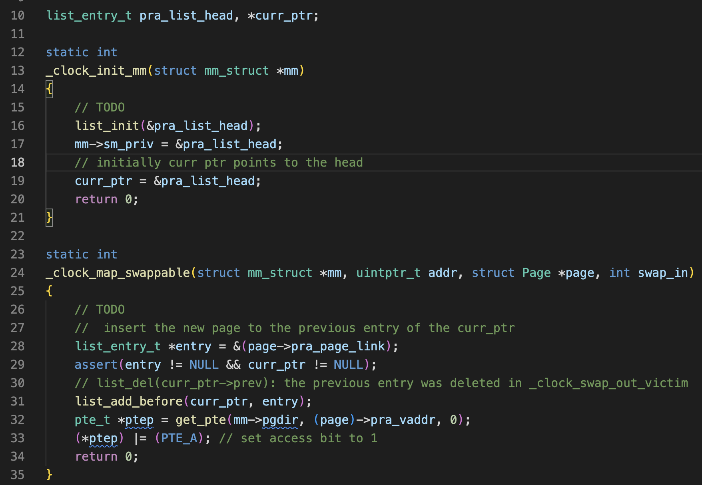
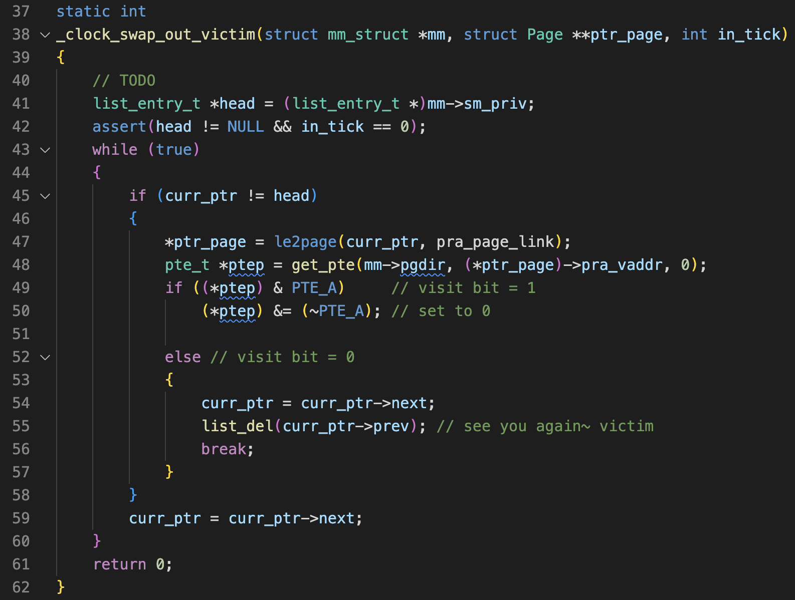

# Assignment 6
12110517 Zhongzhiyuan

## Q1

- The hardware checks whether the page is in physical memory by looking up the page table. If the present bit of the PTE is 0, the page is not in the memory but in the disk(or swap space). The act of accessing a page that is not in physical memory is commonly referred to as a page fault. Upon a page fault, the OS is invoked to service the page fault. A particular piece of code, known as a page-fault handler, runs and must service the page fault.
- If a page has been swapped to disk, the OS will need to swap the page into memory in order to service the page fault. The OS looks in the PTE to find the disk address, and issues the request to disk to fetch the page into memory.
- When the disk I/O completes, the OS will then update the page table to mark the page as present, update the PFN field of the page-table entry (PTE) to record the in-memory location of the newly-fetched page, and retry the instruction. This next attempt may generate a TLB miss, which would then be serviced and update the TLB with the translation (one could alternately update the TLB when servicing the page fault to avoid this step). Finally, a last restart would find the translation in the TLB and thus proceed to fetch the desired data or instruction from memory at the translated physical address
- Note that while the I/O is in flight, the process will be in the blocked state. Thus, the OS will be free to run other ready processes while the page fault is being serviced. Because I/O is expensive, this overlap of the I/O (page fault) of one process and the execution of another is yet another way a multiprogrammed system can make the most effective use of its hardware.
-  If the memory is full, the OS might like to first page out one or more pages to make room for the new page(s) the OS is about to bring in. The process of picking a page to kick out, or replace is known as the page-replacement policy (LRU, FIFO, etc.).

## Q2
three main functions in `swap_clock.c`:

- clock init and clock map swappable:

- clock swap out victim

- result
